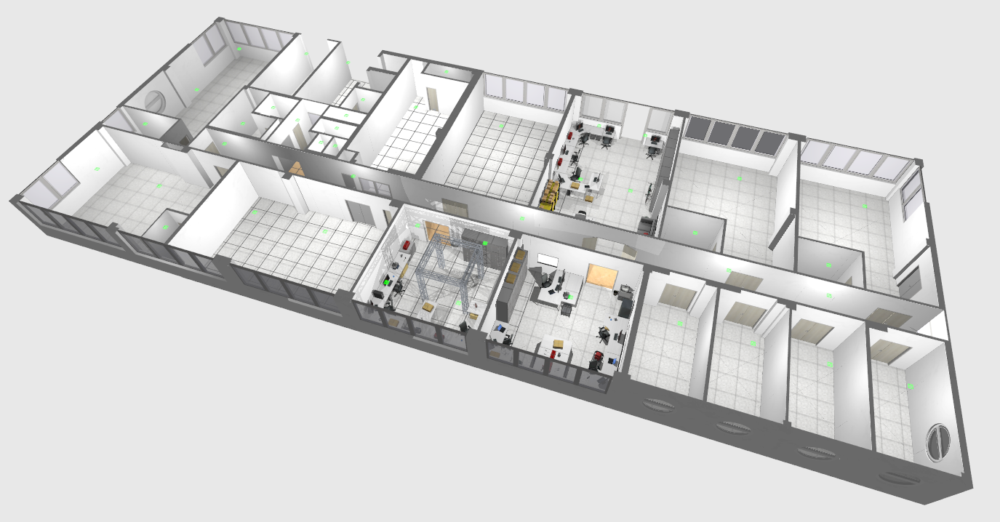
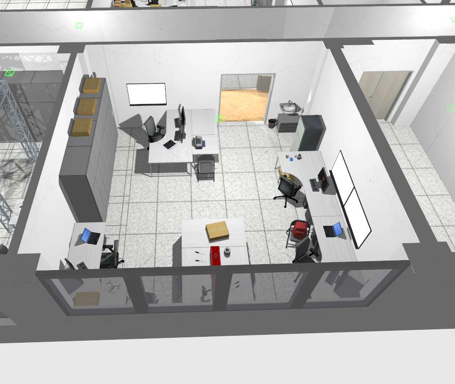
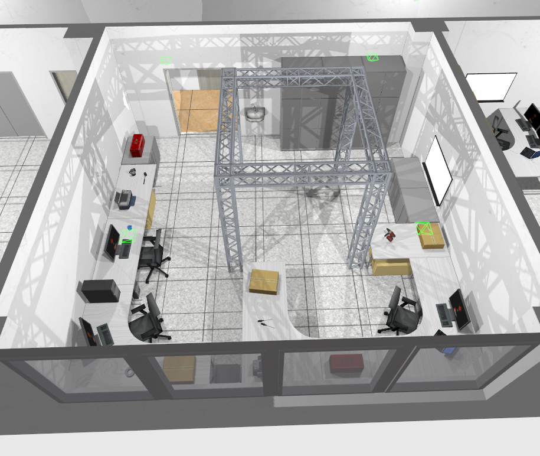

# Workplace of the Department of Control and Instrumentation



### Supported versions of Gazebo 
Garden v7.7.0+ 

This world is intended for UAMT scientists to test the optimization of robot behavior without the need to run physical devices.

## 3D Models included in this Gazebo World

**computer_case** 
**monitor_keyboard**    
**door_70_close, door_70_open**    
**door_80, door_80_handle**    
**door_160_close, door_160_fully_open, door_160_metal_close, door_160_metal_fully_open, door_160_open**    
**entrance_door**   
**storage_90, storage_90_low**    
**storage_140**    
**Box_15x30, Box_33x25**    
**table_80, table_100, table_120, table_150, table_160, table_180, table_200, table L_left, table_L_right, table_small, table_v**    
**walls, walls_roof**    
**windows_1, windows_2, windows_4, windows_door, windows_door_open, windows_O**    

I also reference the following models from https://app.gazebosim.org/fuel/models:

*Actor, JanSport Backpack Red, Bicycle, shelf, Cardboard box, Cordless Drill, Parrot Bebop 2, OfficeChairBlack, foldable_chair, Fridge, Cole_Hardware_Hammer_Black, Aroma_Stainless_Steel_Milk_Frother_2_Cup, Travel_Mate_P_series_Notebook, Radio, Craftsman_Grip_Screwdriver_Phillips_Cushion, Sofa,  Shurtape_Gaffers_Tape_Silver_2_x_60_yd, Toolbox, truss*

| Laboratory       | Picture           |
| :------------- |:-------------:|
| **Laboratory 1.102**     |  |
| **laboratory 1.112**     |  |
| **laboratory 1.113**    | 

## Building and Launching the Gazebo World with your ROS Applications

* Create or update a **.rosinstall** file in the root directory of your ROS workspace. Add the following line to **.rosintall**:
    ```
    - git: {local-name: src/aws-robomaker-small-warehouse-world, uri: 'https://github.com/aws-robotics/aws-robomaker-small-warehouse-world.git', version: master}
    ```
* Change the directory to your ROS workspace and run `rosws update`

* Add the following include to the ROS launch file you are using:
    ```xml
    <launch>
    <!-- Launch World -->
    <include file="$(find aws_robomaker_small_warehouse_world)/launch/small_warehouse.launch"/>
    ...
    </launch>
    ```

* Build your application using `colcon`
    ```bash
    rosws update
    rosdep install --from-paths . --ignore-src -r -y
    colcon build
    ```

## Example: Running this world directly in Gazebo without a ROS application

To open this world in Gazebo, change the directory to your ROS workspace root folder and run:

```bash
cd aws-robomaker-small-warehouse-world
export GAZEBO_MODEL_PATH=`pwd`/models
gazebo worlds/small_warehouse.world
```

## Example: Running this world on Gazebo headless and running the UI on Gzweb
*Tested in ROS Kinetic/Melodic, Gazebo 7/9 with node version 8.11.3/10.22.1*

To open this world in Gzweb, There are two steps,

1) In a terminal, change  to your ROS workspace root folder and run gzserver with the small warehouse world:

```bash
cd aws-robomaker-small-warehouse-world
export GAZEBO_MODEL_PATH=`pwd`/models
gzserver worlds/small_warehouse.world
```

2) In another terminal, setup and run GzWeb
- Install GzWeb by following the [official documentation](http://gazebosim.org/gzweb#install-collapse-1):

    **Important**:
  * The recommended NodeJS versions are 4 up to version 8.  
  * Watch out for [conflicting installations of Node/NodeJS](https://askubuntu.com/questions/695155/node-nodejs-have-different-version)
  * See [Troubleshooting section](http://gazebosim.org/gzweb#install-collapse-3) for other issues
  
- Deploy GzWeb
    - Approach 1: Copy all the Gazebo models from small-warehouse world to gzweb/http/client/assets/, and run the deploy script

    ```bash
    cp -r ~/aws-robomaker-small-warehouse-world/models/. ~/gzweb/http/client/assets
    cd ~/gzweb
    export GAZEBO_MASTER_URI="http://localhost:11345" # change localhost to IP address of the gzserver machine
    npm run deploy
    npm start
    ```

    - Approach 2: without copying the Gazebo models, export Gazebo model path and run the deploy script with `-m local`

    ```bash
    cd aws-robomaker-small-warehouse-world
    export GAZEBO_MODEL_PATH=`pwd`/models
    cd ~/gzweb
    export GAZEBO_MASTER_URI="http://localhost:11345" # change localhost to IP address of the gzserver machine
    npm run deploy --- -m local
    npm start
    ```

## Example: Running this world directly using ROS without a simulated robot

To launch this base Gazebo world without a robot, clone this repository and run the following commands. **Note: ROS and gazebo must already be installed on the host.** 

```bash
# build for ROS
rosdep install --from-paths . --ignore-src -r -y
colcon build

# run in ROS
source install/setup.sh
roslaunch aws_robomaker_small_warehouse_world view_small_warehouse.launch
```
**Visit the [AWS RoboMaker website](https://aws.amazon.com/robomaker/) to learn more about building intelligent robotic applications with Amazon Web Services.**

## Notes
- Lighting might vary on different system(s) (e.g brighter on system without CPU and darker on system with GPU)
- Adjust lighting parameters in .world file as you need
