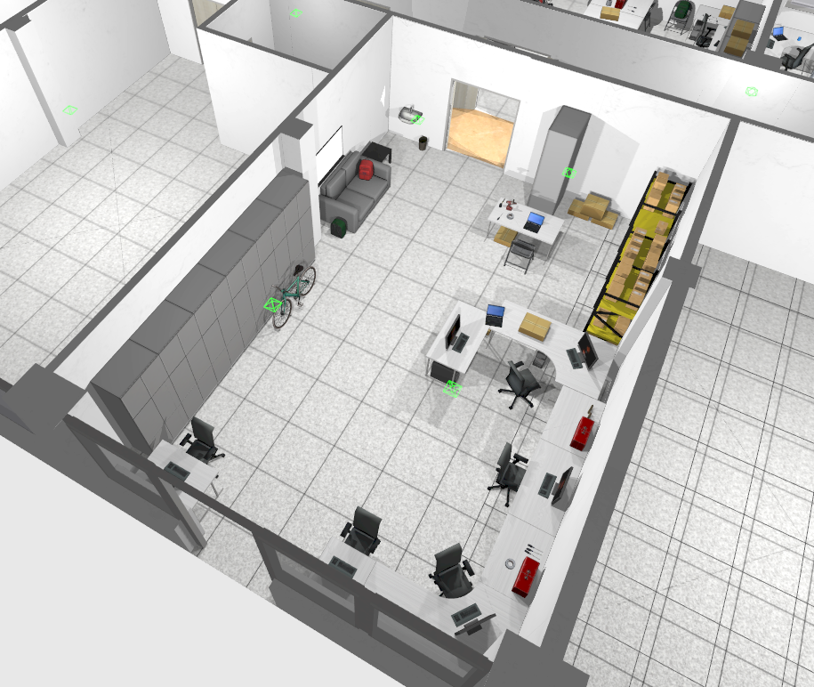

# Workplace of the Department of Control and Instrumentation


### Supported versions of Gazebo 
Garden v7.7.0+ 

## 3D Models included in this Gazebo World

**computer_case** 
**monitor_keyboard**    
**door_70_close, door_70_open**    
**door_80, door_80_handle**    
**door_160_close, door_160_fully_open, door_160_metal_close, door_160_metal_fully_open, door_160_open**    
**entrance_door**   
**storage_90, storage_90_low**    
**storage_140**    
**Box_15x30, Box_33x25**    
**table_80, table_100, table_120, table_150, table_160, table_180, table_200, table L_left, table_L_right, table_small, table_v**    
**walls, walls_roof**    
**windows_1, windows_2, windows_4, windows_door, windows_door_open, windows_O**    

I also reference the following models from https://app.gazebosim.org/fuel/models:

*Actor, JanSport Backpack Red, Bicycle, shelf, Cardboard box, Cordless Drill, Parrot Bebop 2, OfficeChairBlack, foldable_chair, Fridge, Cole_Hardware_Hammer_Black, Aroma_Stainless_Steel_Milk_Frother_2_Cup, Travel_Mate_P_series_Notebook, Radio, Craftsman_Grip_Screwdriver_Phillips_Cushion, Sofa,  Shurtape_Gaffers_Tape_Silver_2_x_60_yd, Toolbox, truss*

| Laboratory       | Picture           |
| :------------- |:-------------:|
| **Robotics - polygon**     |  |
| **Telepresence**     |  |
| **Mobile robots**    | 

## Launching the Gazebo World

1) Download the zip file of the repository, extract it and save it in a suitable directory on your local disk where you will have easy access to the files.
2) Set the GZ_SIM_RESOURCE_PATH environment variable to the directory that contains the model or world. 
Enter this command in the terminal:

```bash
export GZ_SIM_RESOURCE_PATH="$HOME/path/to/folder/workplace-VUT-FEKT-UAMT-world-main"
```

  * (enter actual path instead of /path/to/folder)
3) Change the target directory where the world we want to run is located.
  * Example of running the world no_roof_worlds/lights_ON_all_doors_open_world. Enter this command in the terminal:

```bash
cd ~/path/to/folder/workplace-VUT-FEKT-UAMT-world-main/worlds/no_roof_worlds
```

  * (enter actual path instead of /path/to/folder)
4) Run the simulation:

```bash
gz sim lights_ON_all_doors_open_world.sdf
```
## Launching the example world with the robot and setting up Rviz

1) Set the GZ_SIM_RESOURCE_PATH environment variable to the directory that contains the model or world. 
Enter this command in the terminal:

```bash
export GZ_SIM_RESOURCE_PATH="$HOME/path/to/folder/workplace-VUT-FEKT-UAMT-world-main"
```

  * (enter actual path instead of /path/to/folder)
2) Change the target directory where the world we want to run is located.
  * Enter this command in the terminal:

```bash
cd ~/path/to/folder/workplace-VUT-FEKT-UAMT-world-main/examples/robot_testing_world
```

  * (enter actual path instead of /path/to/folder)
3) Run the simulation:

```bash
gz sim robot_lidar_camera_world.sdf
```
After starting the simulation, we can use the ←↑ ↓ → arrows to control the robot. To stop the robot, press the right CTRL key. In the GUI Visualize Lidar tab, click the refresh button to display the lidar visualization in the simulation.

### Setting up Rviz
Now we need to create a bridge link between Gazebo and Rviz. In the next terminal, enter this command:

```bash
ros2 run ros_gz_bridge parameter_bridge /lidar@sensor_msgs/msg/LaserScan[ignition.msgs.LaserScan --ros-args -r /lidar:=/laser_scan
```

